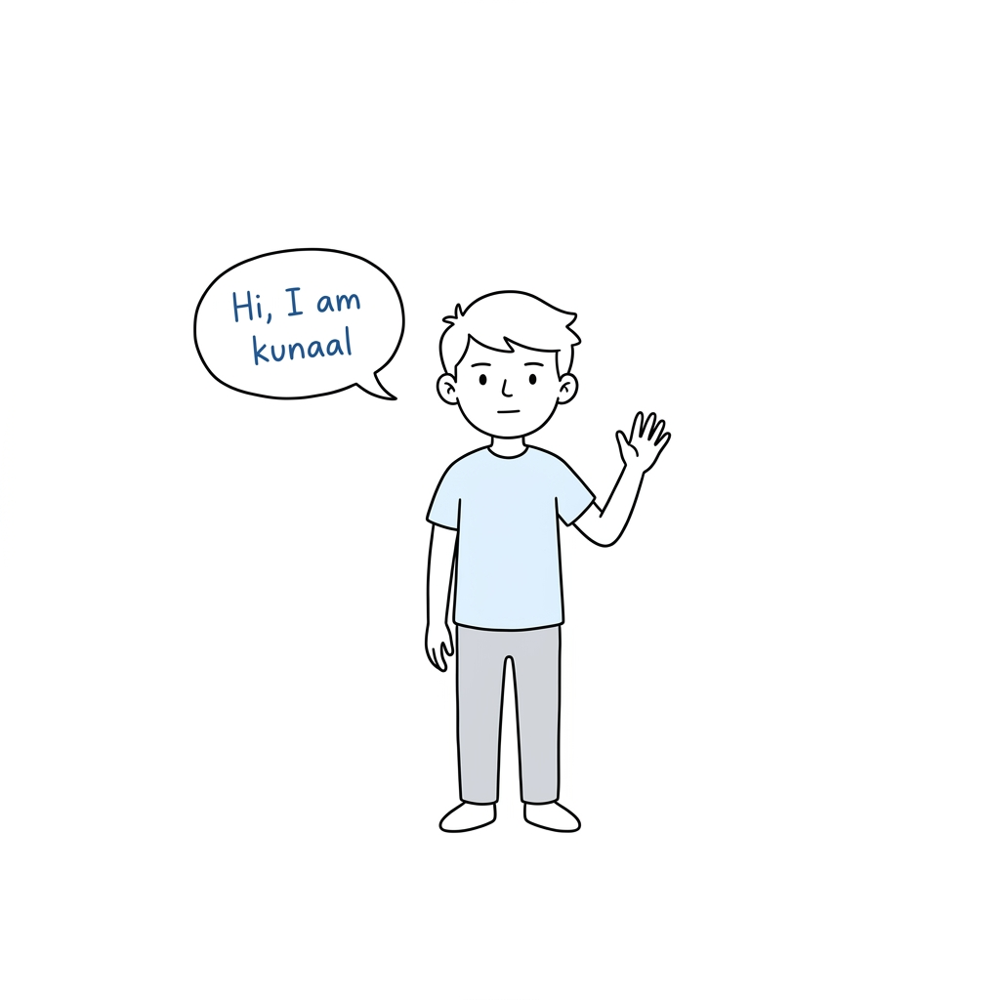
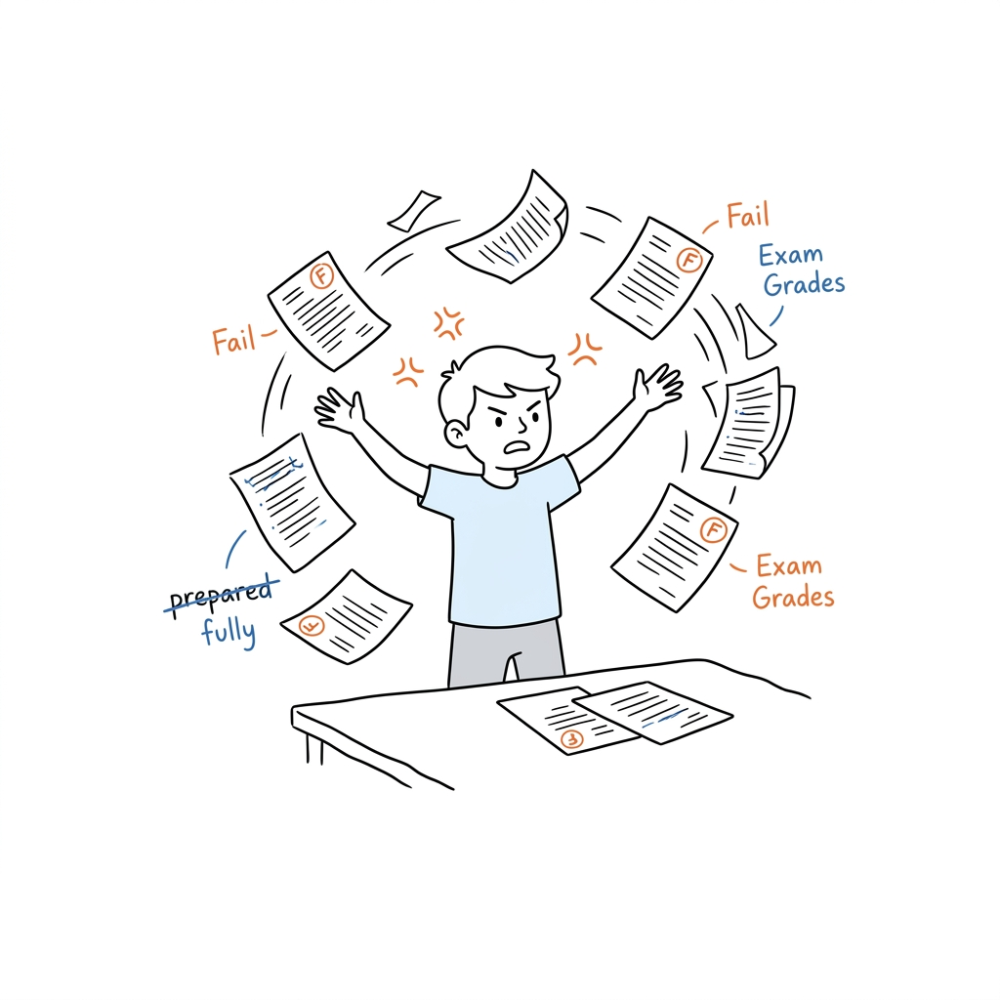
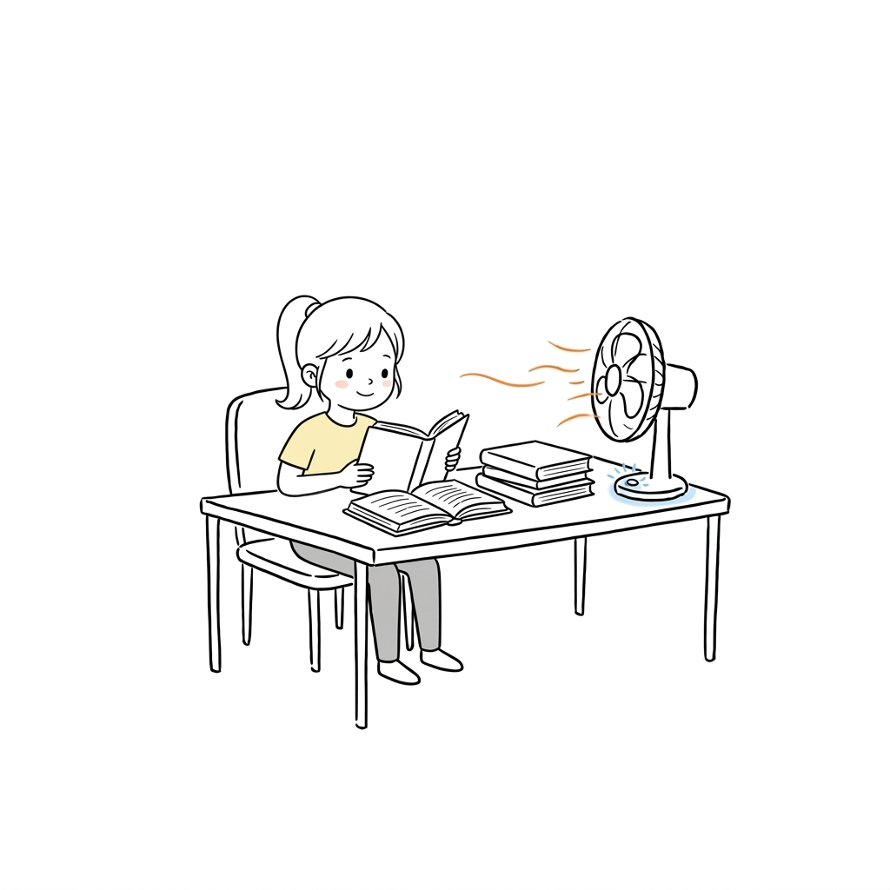
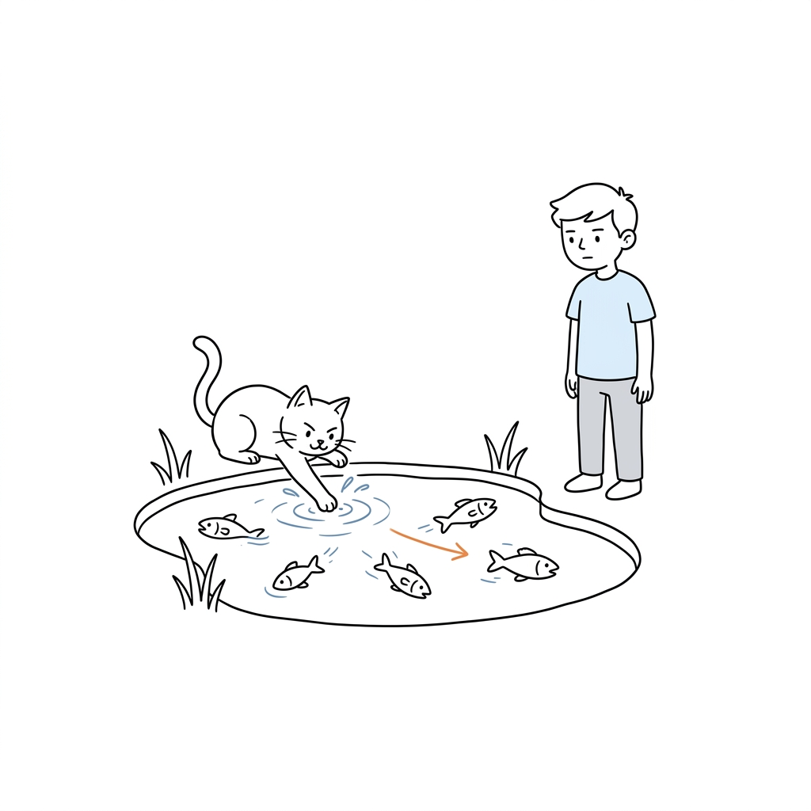
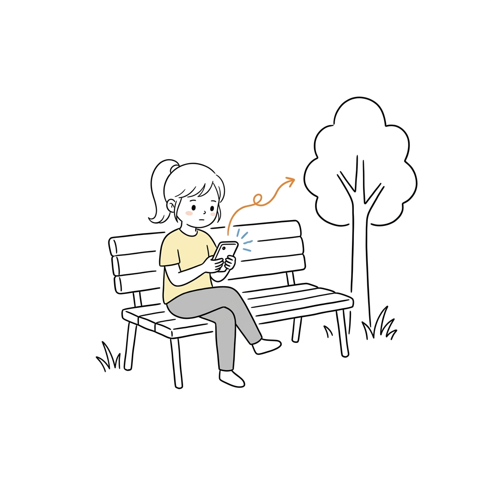
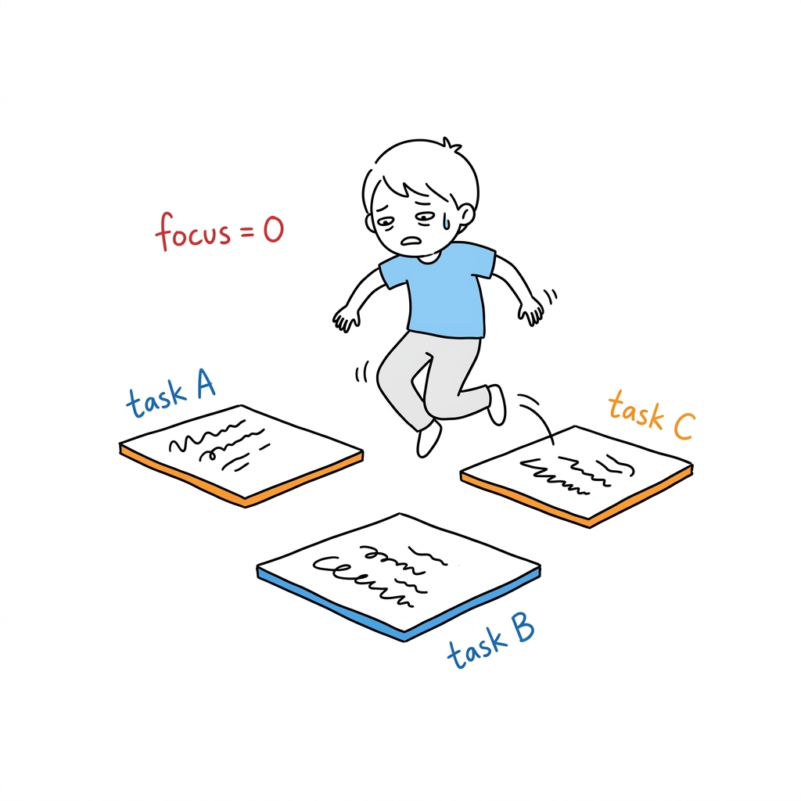
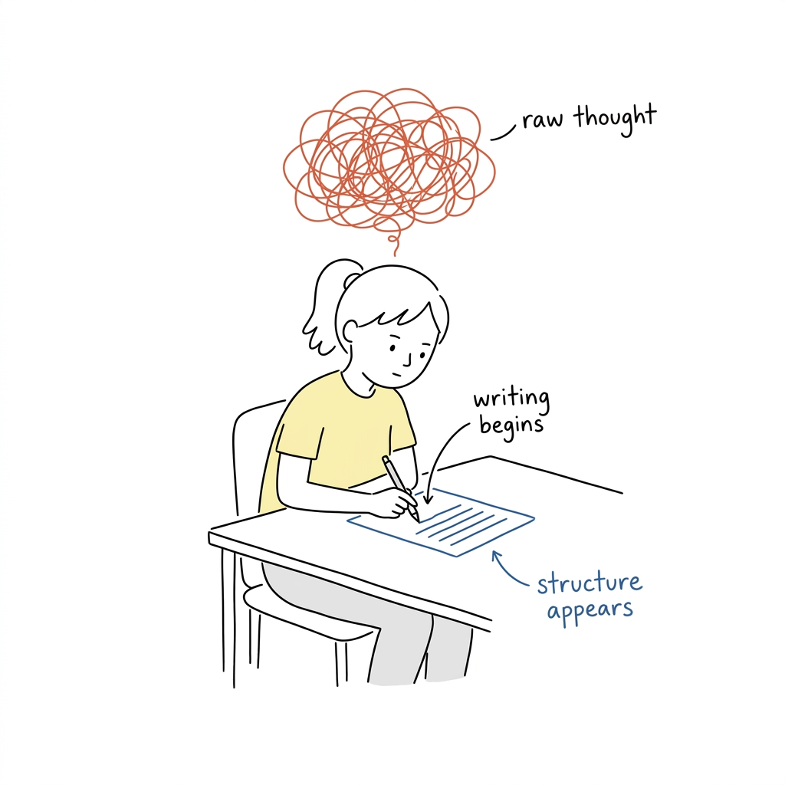

# Kunaal's Illustrations

> Turn the judgments, processes, states, and metaphors in your English articles into clean, hand-drawn, bizarre-but-refreshing inline illustrations.
>
> Wide Composition | Boy & Girl IPs | Pure White Hand-drawn | Sparse Red/Orange/Blue Annotations | Agent Skill

<div align="center">
  
</div>

---

## Gallery

> Real outputs from this skill — paste a prompt, get a hand-drawn illustration.

<div align="center">

| | | |
|:---:|:---:|:---:|
|  |  |  |
| *Boy frustrated with exam grades* | *Girl studying in her room* | *Cat troubling fish in the park* |
|  |  |  |
| *Girl on phone in the park* | *Context switching kills focus* | *Writing turns chaos into structure* |

</div>

---

## ⚡ Quick Start (use only Antigravity with Gemini model to get most accurate images)

1. Open **Antigravity**.
2. Select the **Gemini 3.1 pro (High)** model.
3. In the chat, paste this repository's `.git` URL and tell the agent to install this repo or clone this repo.
4. Once installed, send this message to the agent:

   > "Read `kunaals-illustrations/SKILL.md` and all files inside `kunaals-illustrations/references/` fully. Understand the style rules, character IPs, composition patterns, prompt template, and delivery rules completely — including that every generated image must be saved to the `Generated/` folder in the workspace (create folder if not exist). Once done, ask me for my illustration prompt."

5. The agent will confirm it has understood everything, then ask you:

   > "Type your prompt to generate an illustration. You can refer to `kunaals-illustrations/assets/examples/prompts.txt` for prompt examples."

6. Type your prompt and start generating!

> **Quota tip:** Antigravity's Gemini model has a limited generation quota per session. If you hit the limit, either switch to a different Google account to get a fresh quota, or upgrade to an Antigravity subscription for longer uninterrupted sessions.

---

## What is this repository?

Kunaal's Illustrations is a Skill used to guide AI Agents to generate in-text illustrations for English articles, posts, blogs, Notion documents, and methodology content.

It is not a generic illustration prompt, nor is it a PPT infographic template. Its core goal is: first understand the cognitive anchors in the article, and then turn a judgment, process, structure, state, or metaphor into a memorable hand-drawn explanatory image.

The default visual IPs are:
1. **"Reference Boy"**: A simple hand-drawn boy with short black hair, light blue t-shirt, and grey pants.
2. **"Reference Girl"**: A simple hand-drawn girl with shoulder-length black hair, yellow t-shirt, and dark grey pants.

They are not mascots or decorations standing in the corner, but absurd workers seriously participating in the system's operation.

In short: **Make the AI not just "add a picture," but draw out a key cognitive action from the article.**

---

## Who is it for?

Especially suitable for:

- People writing English articles who need in-text illustrations and article graphics.
- People creating knowledge content, methodology content, and AI workflow content.
- People who want to draw abstract judgments as concrete metaphors.
- People who want an illustration style that is lighter, stranger, and has more personal identity than PPT infographics.
- People using AI for content production who want to stably reuse a consistent visual language.

Not suitable for:

- People who want commercial illustrations, brand key visuals, or exquisite flat illustrations.
- People who want traditional PPT infographics, complex architecture diagrams, or flowcharts.
- People who want children's cartoons, cute IPs, or emoji styles.
- People who want to cram a lot of text, long explanations, or complete course pages into a single image.
- People who need strictly editable vector source files.

---

## What will it produce?

Default output:

- Wide-composition, spacious in-text illustrations.
- A shot list of 4-8 images for an article.
- The theme, core meaning, structure type, character action, and English annotation suggestions for each image.
- Final PNG images, which the AI will automatically save into a `Generated/` folder in your active workspace.

Default non-output:

- PPTX / PDF / Keynote
- SVG / HTML / Canvas editable images
- Commercial posters or cover visuals
- Large text-based infographics

---

## Visual Style

This skill defaults to the "Bizarre In-text Illustration" style:

- Pure white background, no paper texture, beige, shadows, or gradients.
- Black hand-drawn line art, thin lines, slight jitter/wobble.
- Plenty of white space, the main subject only takes up about 40%-60% of the screen.
- Sparse red, orange, and blue English handwritten annotations.
- One image expresses only one core action, structure, state, or metaphor.
- If a character is included, the Boy or Girl character must participate in the core action, not just be decorative.
- Bizarre, creative, and clean, but not childish or trying to be cute.

---

## Installation

Clone the repository:

```bash
git clone https://github.com/Yuvakunaal/kunaal-illustrations.git
cd kunaal-illustrations
```

The skill directory is `kunaals-illustrations/`. Point your agent tool to it, or follow the Quick Start above to use it directly via Antigravity.

---

## How to Use

### Just do illustration planning

```text
Use $kunaals-illustrations, do not generate images yet.
Please analyze where this article is worth illustrating, and output a shot list of about 5 images.
For each image clearly write: which paragraph it goes after, theme, core meaning, structure type, what the character is doing, and suggested English label words.

<Paste Article>
```

### Directly generate in-text illustrations

```text
Use $kunaals-illustrations to generate 4 bizarre in-text illustrations for the article below.
Requirements: Wide composition, pure white background, black hand-drawn line art, sparse red/orange/blue English handwritten annotations.

<Paste Article>
```

### Generate an image for a single concept

```text
Use $kunaals-illustrations to generate an in-text illustration for "Trust is not shouted out, but built piece by piece with evidence."
The picture should be bizarre but clean, and the Boy character must undertake the core action.
```

---

## Workflow

The workflow for this skill is:

1. Read the article, Markdown, Notion content, screenshots, or user-provided themes.
2. Extract core viewpoints, cognitive turns, process structures, and paragraphs suitable for visualization.
3. Output the shot list first: choose only one cognitive anchor for each image.
4. Choose the structure type for each image: Workflow, System component, Before & After, Role state, Conceptual metaphor, Method layering, Map route, or Comic storyboard.
5. Reinvent a low-tech, bizarre but valid physical metaphor.
6. Let the Boy or Girl undertake the core action.
7. Call the image model to generate each image individually.
8. Check against the QA checklist: white background, white space, character action, English annotations, non-PPT feel, non-old-case replication.
9. Save final PNGs and report usage and paths.

---

## Directory Structure

```text
.
├── README.md
├── LICENSE
├── LICENSE-ASSETS
├── NOTICE.md
├── CODE_OF_CONDUCT.md
├── SECURITY.md
├── CONTRIBUTING.md
├── .github/
│   ├── ISSUE_TEMPLATE/
│   │   ├── bug_report.md
│   │   └── feature_request.md
│   └── pull_request_template.md
└── kunaals-illustrations/
    ├── SKILL.md
    ├── agents/
    │   └── openai.yaml
    ├── assets/
    │   └── examples/ (Contains generated examples and prompts.txt to show the AI how to draw)
    └── references/
        ├── style-dna.md
        ├── character-ip.md
        ├── composition-patterns.md
        ├── prompt-template.md
        ├── qa-checklist.md
        ├── prompts.md
        └── images/
```

The directory that actually needs to be installed as a skill is:

```text
kunaals-illustrations/
```

The root README, LICENSE, and NOTICE are repository sharing documents.

---

## Notes

- The shorter the English text in the pictures, the more stable it is.
- Each picture only talks about one core structure; do not turn the article into a manual.
- The character must undertake the core action; if removing the character still leaves the picture completely valid, the character is too decorative.
- Example pictures are only used to calibrate line density, white space, color restraint, and character participation. Do not duplicate the composition.
- AI image models may produce typos, hallucinated labels, style drift, or extra titles, and need to be checked after generation.
- If there are severe typos, prioritize reducing the number of labels and regenerating.

---

## License

This repository uses a **dual license** structure:

| Content | License |
|---|---|
| Skill code, prompt templates, agent configs, Markdown docs | [MIT License](LICENSE) |
| Example images, character IPs, style/composition references | [CC BY 4.0](LICENSE-ASSETS) |

**CC BY 4.0 assets require attribution.** When using or adapting images, character IPs, or style references from this repo, credit **"Kunaal's Illustrations" by Kunaal** and link back to this repository.

See [NOTICE.md](NOTICE.md) for full details.

---

## About the Author

**Yuva Kunaal** — AI Engineer · SaaS Founder · Vibe coder

Built this as a personal tool to generate consistent, bizarre in-text illustrations for English articles and knowledge content.

<div align="center">

<a href="https://www.linkedin.com/in/boggavarapu-yuva-satya-kunaal-127817290/" target="_blank" rel="noopener noreferrer">
  
</a>

<a href="mailto:bhavikunaal@gmail.com" target="_blank" rel="noopener noreferrer">
  
</a>

<a href="https://kunaal-portfolio.vercel.app/" target="_blank" rel="noopener noreferrer">
  
</a>

<a href="https://dev.to/yuva_kunaal" target="_blank" rel="noopener noreferrer">
  
</a>

</div>
